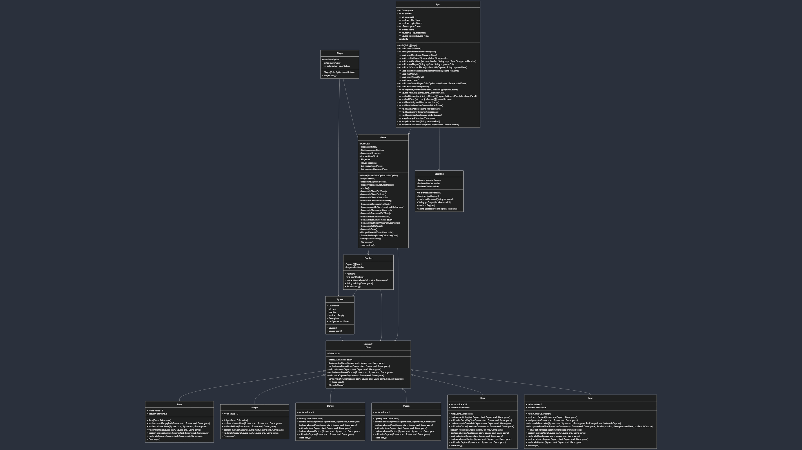

# JChess Project
### Cojocaru Daniela

## Overview
This project implements a chess game simulation in Java, featuring core components such as players, a board, pieces, and game logic. It includes classes to represent the chessboard, game state, and chess pieces, adhering to object-oriented principles.

---

## Objectives

1. **Learn and Apply Object-Oriented Principles**  
   The project aims to enhance understanding and practical application of core OOP concepts like inheritance, 
   polymorphism, encapsulation, and abstraction.

2. **Simulate a Chess Game**  
   Provide a functional representation of chess, allowing users to play a game with all basic rules implemented
   against a chess engine (Stockfish).

3. **Build a Foundation for Advanced Features**  
   Create a flexible design that can be extended with features like advanced rules (castling, en passant, promotion), 
   AI opponents (using Stockfish), and an interactive graphical user interface (GUI) with Swing.

4. **Foster Problem-Solving and Algorithm Design Skills**  
   Develop logic to validate moves, detect game states (check, checkmate, stalemate, 50-Moves Rule), and manage 
   player interaction.

5. **Encourage Code Modularity and Reusability**  
   Design components that are modular, testable, and reusable for potential expansion or integration into larger systems.

---

## Classes and Responsibilities

### **1. Player**
**Package**: `elements`
- Represents a chess player.
- **Attributes**:
  - `Game.Color playerColor`: The player's color (WHITE or BLACK).
  - `ColorOption colorOption`: The player's color choice (WHITE, BLACK, or RANDOM).
- **Methods**:
  - `Player(ColorOption colorOption)`: Constructs a player with the specified color option. If the color option is RANDOM, the player is randomly assigned a color.
  - `ColorOption getColorOption()`: Returns the player's color choice.
  - `Player copy()`: Creates a copy of the current player with the same color and color option.

### **2. Square**
**Package**: `elements`
- Represents a single square on the chessboard.
- **Attributes**:
  - `Game.Color color`: The color of the square (WHITE or BLACK).
  - `int rank`: The row index of the square.
  - `char file`: The column index of the square.
  - `boolean isEmpty`: Indicates whether the square is empty.
  - `Piece piece`: The chess piece occupying the square (if any).
- **Methods**:
  - `Game.Color getColor()`: Returns the color of the square.
  - `int getRank()`: Returns the rank (row) of the square.
  - `char getFile()`: Returns the file (column) of the square.
  - `boolean getIsEmpty()`: Returns whether the square is empty.
  - `Piece getPiece()`: Returns the piece occupying the square, if any.
  - `void setColor(Game.Color color)`: Sets the color of the square.
  - `void setRank(int rank)`: Sets the rank (row) of the square.
  - `void setFile(char file)`: Sets the file (column) of the square.
  - `void setIsEmpty(boolean empty)`: Sets whether the square is empty.
  - `void setPiece(Piece piece)`: Sets the piece occupying the square.
  - `Square copy()`: Creates a copy of the current square, including all its properties and piece (if any).
  - `String toString()`: Returns a string representation of the square's position (e.g., "a1", "h8").

### **3. Position**
**Package**: `elements`
- Represents the board state and position of pieces.
- **Attributes**:
  - `Square[][] board`: A 2D array of squares representing the board.
  - `int positionNumber`: The position's identifier.
  - `boolean whiteAllowedCastle`: Indicates if white can castle.
  - `boolean blackAllowedCastle`: Indicates if black can castle.
- **Methods**:
  - `Position()`: Initializes the board and sets the starting position.
  - `startPosition()`: Arranges pieces in their initial positions.
  - `String toStringRank(int i, int j, Game game)`: Returns a string representation of the rank (row) and file (column) of a given square, including the piece occupying the square.
  - `String toString(Game game)`: Returns a string representation of the entire board, displaying each square with its piece and color.

### **4. Move**
**Package**: `elements`
- Represents a move in a chess game, including details such as the start and end squares, 
  the piece moved, move notation, and the resulting position after the move.
- **Attributes**:
  - `Square start`: The square from which the move starts.
  - `Square end`: The square to which the move ends.
  - `int moveNumber`: The number of this move in the sequence of the game.
  - `Piece movedPiece`: The chess piece that is moved during this move.
  - `String moveNotation`: The chess notation representing this move (e.g., "e4", "Nxf3").
  - `Position positionAfterMove`: The board position after this move is executed.
- **Methods**:
  - `Move(Square start, Square end, int moveNumber, Piece movedPiece, String moveNotation, Position positionAfterMove)`: 
     Initializes a new move with the provided details.
  - `Square getStart()`: Returns the starting square of the move.
  - `Square getEnd()`: Returns the ending square of the move.
  - `int getMoveNumber()`: Returns the move number in the game's sequence.
  - `Piece getMovedPiece()`: Returns the piece involved in the move.
  - `String getMoveNotation()`: Returns the move in standard chess notation.
  - `Position getPositionAfterMove()`: Returns the board position after this move is executed.
  - `String toString(Game game)`: Converts the move to a string, including the resulting board state, move number, and notation.
  - `Move copy()`: Creates and returns a deep copy of the move, including the associated pieces and board position.

### **5. Piece (Abstract)**
**Package**: `Project.src`
- The base class for all chess pieces.
- **Attributes**:
  - `Game.Color color`: The piece's color (either white or black).
  - `String WHITE_PAWN`: Constant for white pawn symbol.
  - `String WHITE_ROOK`: Constant for white rook symbol.
  - `String WHITE_KNIGHT`: Constant for white knight symbol.
  - `String WHITE_BISHOP`: Constant for white bishop symbol.
  - `String WHITE_QUEEN`: Constant for white queen symbol.
  - `String WHITE_KING`: Constant for white king symbol.
  - `String BLACK_PAWN`: Constant for black pawn symbol.
  - `String BLACK_ROOK`: Constant for black rook symbol.
  - `String BLACK_KNIGHT`: Constant for black knight symbol.
  - `String BLACK_BISHOP`: Constant for black bishop symbol.
  - `String BLACK_QUEEN`: Constant for black queen symbol.
  - `String BLACK_KING`: Constant for black king symbol.
- **Methods**:
  - `Piece(Game.Color color)`: Constructs a Piece with the specified color.
  - `boolean allowedMove(Square start, Square end, Game game)`: Abstract method to determine if a move is allowed based on the piece's movement rules.
  - `void makeMove(Square start, Square end, Game game)`: Makes a move from the start square to the end square if the move is valid and does not put the player in check.
  - `boolean allowedCapture(Square start, Square end, Game game)`: Abstract method to determine if a capture is allowed based on the piece's movement rules.
  - `void makeCapture(Square start, Square end, Game game)`: Makes a capture from the start square to the end square if the capture is valid and does not put the player in check.
  - `String moveNotation(Square start, Square end, Game game, boolean isCapture)`: Returns the move notation for a given move, including disambiguation for certain pieces.
  - `Piece copy()`: Creates a copy of the current piece.
  - `String toString()`: Returns the string representation of the piece (e.g., "P" for white pawn, "r" for black rook).

### **6. Chess Pieces**
#### Common Attributes:
- **`Color color`**: The color of the piece (either white or black).

#### Rook
- Moves horizontally or vertically.
- **Advanced Functionality**: Can participate in **castling**, a special move with the King under certain conditions.

#### Knight
- Moves in an L-shape (two squares in one direction and one in a perpendicular direction).

#### Bishop
- Moves diagonally.

#### Queen
- Moves horizontally, vertically, or diagonally.

#### King
- Moves one square in any direction.
- **Advanced Functionality**: Can participate in **castling** King side `(O-O)` or Queen side `(O-O-O)` if it hasn’t moved yet, and there are no pieces between it and the Rook.

#### Pawn
- Moves one square forward (two squares on its first move). Captures diagonally.
- **Advanced Functionality**:
  - Can perform **en passant** if an opposing Pawn moves two squares forward from its starting position and lands adjacent to the Pawn.
  - Can **promote** if it reaches the back rank (`8`th rank for `White` and `1`st rank for `Black`).

### **7. Game**
**Package**: `Project.src`
- Manages the game logic and player interaction.
- **Attributes**:
  - `List<Move> gameHistory`: List of moves played during the game.
  - `Position currentPosition`: Current position of the chess pieces on the board.
  - `boolean whiteMoves`: Indicates whether it's White's turn to move.
  - `int halfMoveClock`: Counter for half moves since the last capture or pawn advance.
  - `Player me`: The player representing the user.
  - `Player opponent`: The opponent player.
  - `List<Piece> meCapturedPieces`: List of pieces captured by the user.
  - `List<Piece> opponentCapturedPieces`: List of pieces captured by the opponent.
- **Methods**:
  - `Game(Player.ColorOption colorOption)`: Constructs a new Game instance, initializing players and the board position.
  - `public Player getMe()`: Returns the player object representing the current player.
  - `public List<Piece> getMeCapturedPieces()`: Returns the list of pieces that have been captured by the current player.
  - `public List<Piece> getOpponentCapturedPieces()`: Returns the list of pieces that have been captured by the opponent.
  - `public void display()`: Displays the current game state, including the last move and whether the White or Black player is in check.
  - `public boolean isCheckForWhite()`: Checks if the White player is currently in check.
  - `public boolean isCheckForBlack()`: Checks if the Black player is currently in check.
  - `private boolean isCheck(Color color)`: Checks if the player of the specified color is in check by examining if any opponent piece can threaten the king.
  - `public boolean isCheckmateForWhite()`: Checks if the White player is in checkmate.
  - `public boolean isCheckmateForBlack()`: Checks if the Black player is in checkmate.
  - `public boolean possibleMoveFromCheck(Color color)`: Determines if there are any valid moves that could potentially escape a check situation for the given player.
  - `public boolean isCheckmate(Color color)`: Checks if the specified player is in checkmate by first determining if they are in check and then verifying if there is no valid move to escape it.
  - `public boolean isStalemateForWhite()`: Checks if the White player is in stalemate, meaning they cannot make a move but are not in check.
  - `public boolean isStalemateForBlack()`: Checks if the Black player is in stalemate, meaning they cannot make a move but are not in check.
  - `public boolean isStalemate(Color color)`: Checks if the specified player is in stalemate by verifying that they cannot make a move and are not in check.
  - `public boolean insufficientMaterial(Color color)`: Checks if the given player has insufficient material to checkmate the opponent (e.g., only a king left against a lone king or a king and a knight/bishop).
  - `public boolean rule50Moves()`: Checks if the 50-move rule has been reached, meaning 50 half-moves have been made without a pawn move or piece capture.
  - `public boolean isDraw()`: Checks if the game is a draw due to stalemate, insufficient material, or the 50-move rule.
  - `public List<Square> getPiecesOfColor(Color color)`: Retrieves all squares containing pieces of the specified color.
  - `private Square findKingSquare(Color kingColor)`: Finds and returns the square containing the king of the specified color.
  - `public String FENNotation()`: Generates a FEN (Forsyth-Edwards Notation) string representing the current state of the game.
  - `public Game copy()`: Creates and returns a deep copy of the current game, including the board, pieces, and game history.
  - `public void destroy()`: Destroys the current game by clearing all game-related data, including game history and captured pieces.

### **8. App**
**Package**: `Project.src`
- The main entry point and manager for the Chess game application.
- **Attributes**:
  - `Game game`: The currently active game instance.
  - `int gameID`: The unique identifier for the current game in the database.
  - `int positionID`: The unique identifier for the current board position in the database.
  - `boolean isUserTurn`: Flag indicating if it is the user's turn.
  - `boolean engineMoved`: Flag indicating if the chess engine has made a move.
  - `JFrame gameFrame`: The main game frame displayed to the user.
  - `JPanel board`: The chessboard panel containing the squares and pieces.
  - `JButton[][] squareButtons`: A 2D array of buttons representing the chessboard squares.
  - `Square selectedSquare`: The currently selected square on the board (private).
  - **Constants**:
    - `ImageIcon WHITE_PAWN, BLACK_PAWN, WHITE_ROOK, BLACK_ROOK, ...`: Constants for chess piece icons.
    - `int BOARD_SIZE`: Size of the chessboard (8x8).

- **Methods**:
  - `main(String[] args)`: Entry point of the application. Initializes the main menu.
  - `stockfishMove()`: Initiates the Stockfish engine to calculate the best move and performs the move.
  - `getStockfishMove(String FEN)`: Retrieves the best move from the Stockfish engine given a position in FEN format.
  - `insertNewGame(String myColor)`: Inserts a new game record into the database with the specified player's color.
  - `editEndGame(String myColor, String result)`: Updates the game record in the database when the game ends.
  - `insertNewMove(int moveNumber, String playerTurn, String moveNotation)`: Inserts a new move record into the database.
  - `insertPlayers(String myColor, String opponentColor)`: Inserts player details into the database for the current game.
  - `editCapturedPieces(boolean isMyCapture, String capturedPiece)`: Updates the record of captured pieces for a player in the database.
  - `insertNewPosition(int positionNumber, String fenString)`: Inserts a new board position record into the database.
  - `startMenu()`: Displays the main menu of the application.
  - `selectColorMenu()`: Displays the color selection menu for the player.
  - `gameFrame()`: Initializes and displays the main game frame.
  - `startGame(colorOption, colorFrame)`: Starts a new game and sets the user's turn.
  - `endGame(result)`: Displays the game result with options to restart or exit.
  - `update(boardPanel, squareButtons)`: Updates the board UI and manages turn transitions.
  - `findKingSquare(kingColor)`: Finds the square containing the king of the specified color.
  - `addSquare(i, j, squareButtons, chessBoardPanel)`: Adds a square to the board with appropriate action listeners.
  - `addPiece(i, j, squareButtons)`: Adds a piece icon to a square.
  - `handleSquareClick(row, col)`: Handles user clicks for piece selection and movement.
  - `handleSelection(clickedSquare)`: Handles the selection of a square by the user, ensuring it's a valid piece selection.
  - `handleAction(clickedSquare)`: Handles the action when a selected piece interacts with a target square (move or capture).
  - `handleMove(clickedSquare)`: Handles a piece move to an empty square, validating and applying the move.
  - `handleCapture(clickedSquare)`: Handles a piece capture, ensuring it is valid according to the game rules.
  - `getPieceIcon(piece)`: Retrieves the appropriate icon for a given chess piece.
  - `loadIcon(resourcePath)`: Loads an icon from a specified resource path.
  - `scaleIcon(originalIcon, button)`: Scales an icon to fit within a button, maintaining its aspect ratio.

### **9. Stockfish**
**Package**: `engine`
- A class that interacts with the Stockfish chess engine to make moves, retrieve engine output, and manage its lifecycle.
**Attributes**:
- `Process stockfishProcess`: The running instance of the Stockfish engine.
- `BufferedReader reader`: Reads the output from the Stockfish engine.
- `BufferedWriter writer`: Sends commands to the Stockfish engine.
**Methods**:
- `File extractStockfishExe()`: Extracts the Stockfish executable from resources and saves it as a temporary file.
- `boolean startEngine()`: Starts the Stockfish engine by extracting the executable and launching the process.
- `void sendCommand(String command)`: Sends a command to the Stockfish engine.
- `String getOutput(int timeoutMillis)`: Reads the engine's output for a specified amount of time.
- `void stopEngine()`: Stops the Stockfish engine by sending the quit command and destroying the process.
- `String getBestMove(String fen, int depth)`: Gets the best move from Stockfish for a given board position and search depth.

---

## Class Diagram

---

## How to Run
1. Clone the repository.
2. Build the project using your preferred IDE.
3. Run the `App.main()` method to start the game.
4. Follow the console prompts to play.

---

## Future Improvements
- Develop a GUI to enhance the user experience, including panels for user icons, the user's and engine's captured pieces, game history (moves and their numbers), and a feature to display all possible squares where the selected piece can move.
- Improve the app's performance for faster gameplay.
- Develop an online multiplayer server where users can play against each other, with a rating system for all players.
- Implement difficulty levels for the AI chess engine based on the depth of the Mini-Max algorithm, as used in Stockfish.

---

## Acknowledgments
This project is built with Java and adheres to standard object-oriented principles for modeling chess games.
